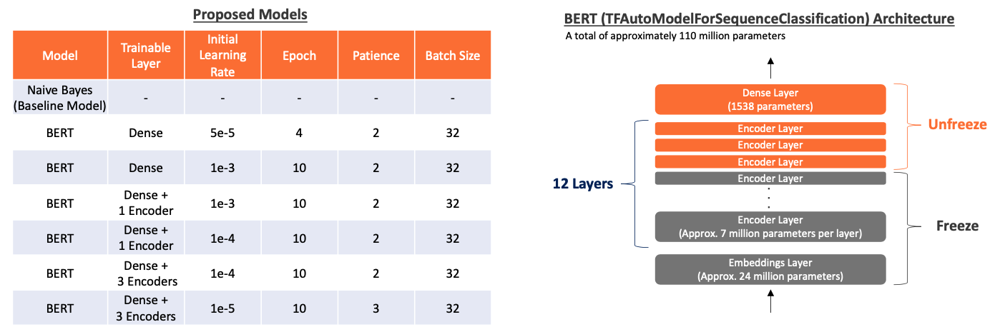
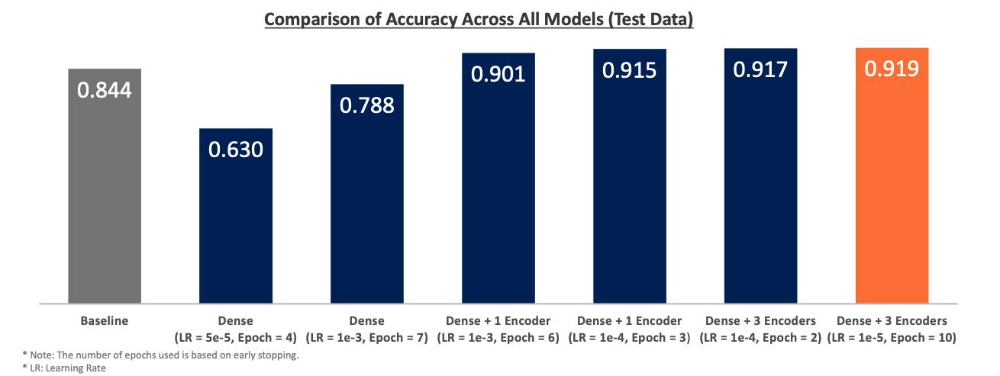

# Fine-Tuned BERT for IMDb Review Sentiment Analysis

**University of Chicago - Machine Learning & Predictive Analytics Final Project**

## Purpose
BERT (Bidirectional Encoder Representations from Transformers) has been trained on vast amounts of data, making it applicable to a wide range of domains. However, since it is not domain-specific, fine-tuning BERT for a particular domain can enhance its performance. In this project, I aim to create a fine-tuned BERT model specialized for IMDb movie reviews to improve the accuracy of classifying reviews as positive or negative.

**For more details, please refer to [the presentation](Fine-Tuned BERT for IMDb Review Sentiment Analysis.pdf).**

## Data Source
[IMDB Movie Ratings Sentiment Analysis Dataset](https://www.kaggle.com/datasets/yasserh/imdb-movie-ratings-sentiment-analysis/data)

## Approach
- I will gradually make the Dense layers and some Encoder layers trainable. Increasing the number of trainable layers could allow the model to specialize in the domain, but it is necessary to be cautious of the risk of overfitting. I assume that the lower layers (those closer to the input layer) will still be useful for this task, as they capture high-level features.
- Early Stopping is introduced to prevent overfitting. The learning rate and number of epochs will be adjusted based on the results.

## Results (Accuracy) and Learnings from the Methodology
- By expanding the fine-tuning from only the dense layer to include the encoder layers, I was able to create a classifier specialized for IMDb movie reviews, gradually improving its accuracy.
- Unfreezing the encoder layers improved the classification accuracy overall, especially for negative sentiment, which the dense layers alone struggled to classify effectively.
- However, the improvement in accuracy from expanding from 1 encoder layer to 3 encoder layers was minimal. Therefore, for this dataset, fine-tuning just one encoder layer was sufficient to achieve a high accuracy, considering the computational resources and time.
- Additionally, I found that adjusting the learning rate and using early stopping to avoid overfitting improved accuracy. This also highlighted the importance of choosing an appropriate learning rate based on the number of parameters being trained.

